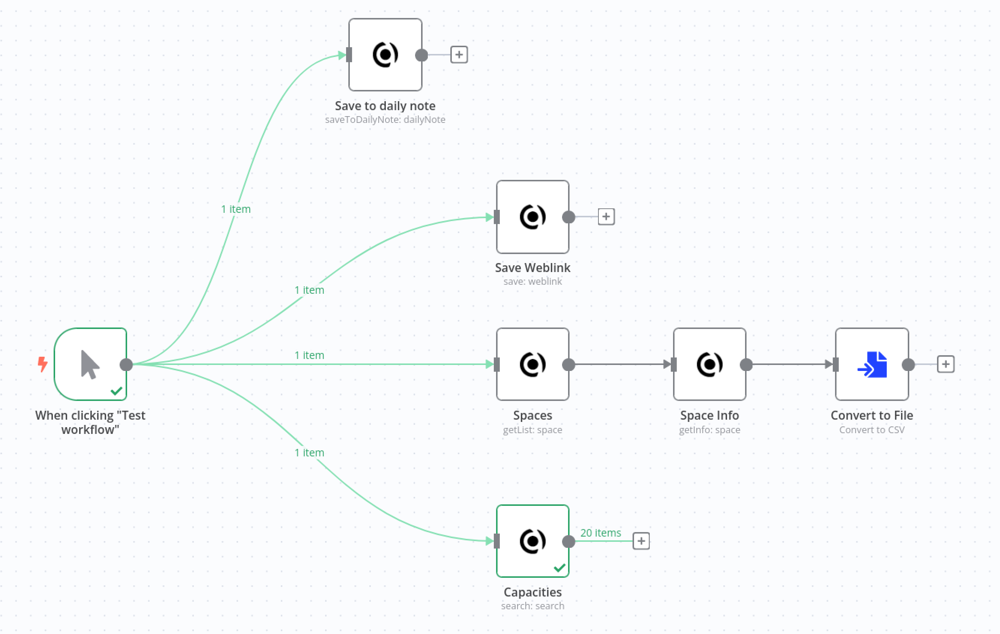
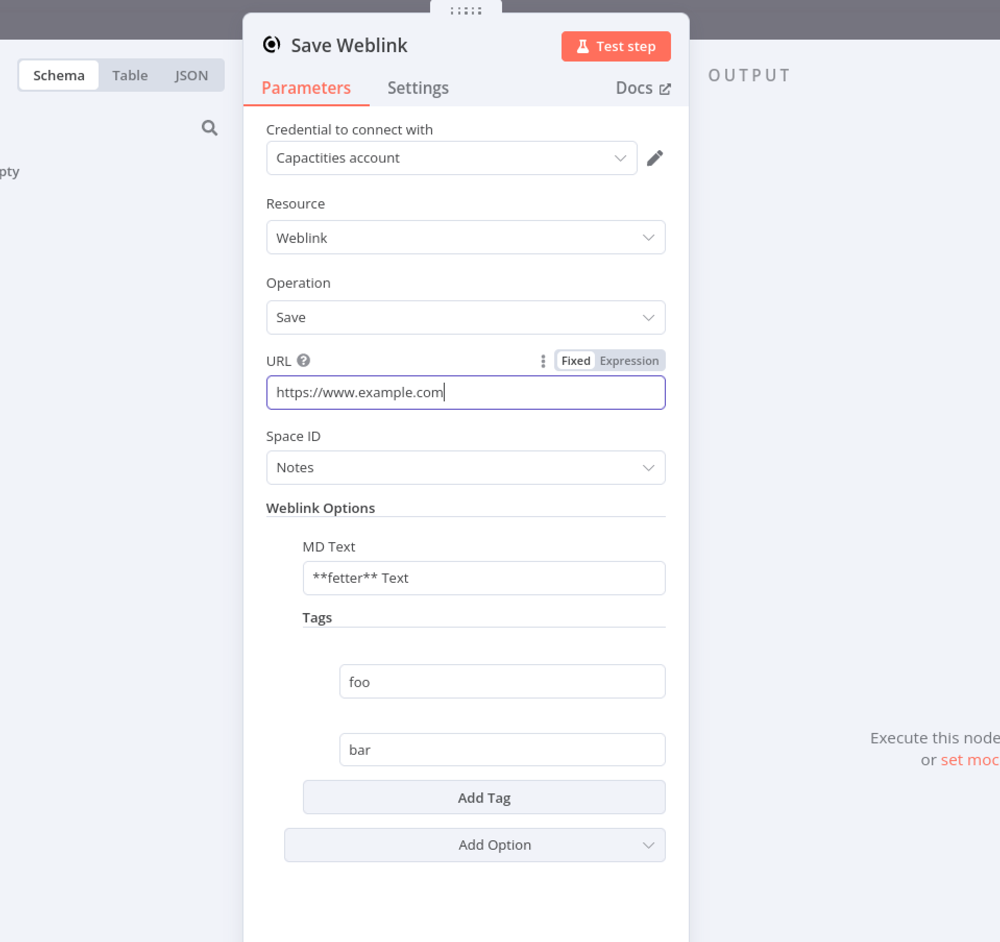

# n8n-nodes-capacities

This repository contains the code for the n8n nodes that interact with the [Capacities API](https://docs.capacities.io/developer/api).

## Installation

Install the package into your n8n instance (Community Edition or self-hosted) so the bundled node becomes 
available in the editor sidebar. The n8n team recommends pnpm, but npm should also work as well.

```bash
pnpm add @muench-dev/n8n-nodes-capacities
```

> Prefer npm? Run `npm install @muench-dev/n8n-nodes-capacities` instead.

## Node Features

- Space operations
	- List all spaces in the authenticated Capacities account
	- Retrieve structure metadata for a specific space
- Search operations
	- Query notes, bookmarks, or other content within selected spaces
	- Filter results by Capacities structure types
- Weblink operations
	- Save URLs into Capacities, including optional markdown, title overrides, descriptions, and tags
- Daily note operations
	- Append markdown to today’s daily note, optionally skipping the automatic timestamp

## Screenshots




## Development

1. Install dependencies using pnpm (recommended for this repository):

```bash
pnpm install
```

2. Build the distributable bundle (outputs to `dist/`):

```bash
pnpm build
```

3. Run the linter to ensure n8n community guidelines are met:

```bash
pnpm lint
```

4. Execute the Jest test suites (API requests are mocked):

```bash
pnpm test
```

Additional context for contributors—coding conventions, testing strategy, and release process—is documented in `AGENTS.md`.
