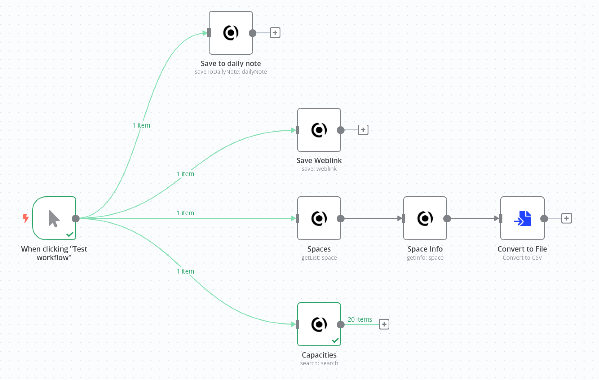
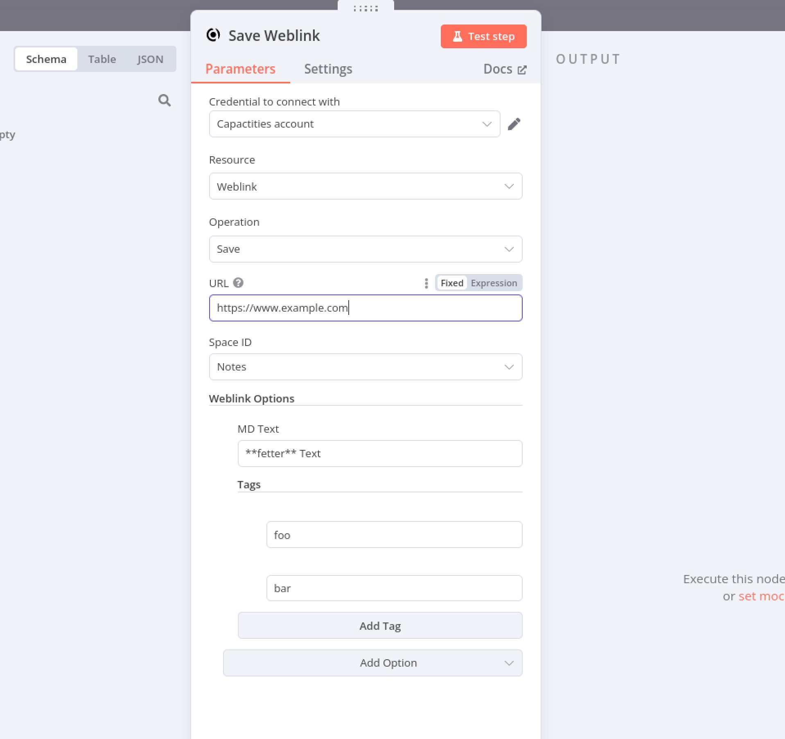

# n8n-nodes-capacities

This repository contains the code for the n8n nodes that interact with the [Capacities API](https://developers.capacities.io).

## API Versions

This node ships two versions side by side:

- **v2 (default for new nodes)** talks to the current [Capacities v1 API](https://developers.capacities.io/api/overview/migration). Tokens are scoped to a single space, so there's no more Space ID selector. Note: the new `/object/url` endpoint has no `tags` parameter, so Weblink tags aren't supported in this version.
- **v1 (legacy, kept for existing workflows)** talks to the deprecated Capacities Beta API. Workflows created before this update keep using it unchanged. Capacities is retiring the Beta API on **2026-09-01** — after that date, `v1`-typed nodes will stop working and existing workflows should be re-saved with a new Capacities node (or have their node version bumped) to pick up `v2`.

If you're building a new workflow, use a fresh Capacities node and a personal API token generated under **Settings → Capacities API** in the desktop app.

## Installation

Install the package into your n8n instance (Community Edition or self-hosted) so the bundled node becomes 
available in the editor sidebar. The n8n team recommends pnpm, but npm should also work as well.

```bash
pnpm add @muench-dev/n8n-nodes-capacities
```

> Prefer npm? Run `npm install @muench-dev/n8n-nodes-capacities` instead.

## Node Features

- Space operations
	- Get the space the API token is scoped to
	- Retrieve structure metadata for the space
- Search operations
	- Query notes, bookmarks, or other content, optionally filtered by structure type
- Weblink operations
	- Save URLs into Capacities, including optional markdown, title, and description overrides
- Daily note operations
	- Append markdown to a daily note, optionally skipping the automatic timestamp or targeting a specific date

## Screenshots




## Development

1. Install dependencies using pnpm (recommended for this repository):

```bash
pnpm install
```

2. Build the distributable bundle (outputs to `dist/`):

```bash
pnpm build
```

3. Run the linter to ensure n8n community guidelines are met:

```bash
pnpm lint
```

4. Execute the Jest test suites (API requests are mocked):

```bash
pnpm test
```

Additional context for contributors—coding conventions, testing strategy, and release process—is documented in `AGENTS.md`.
