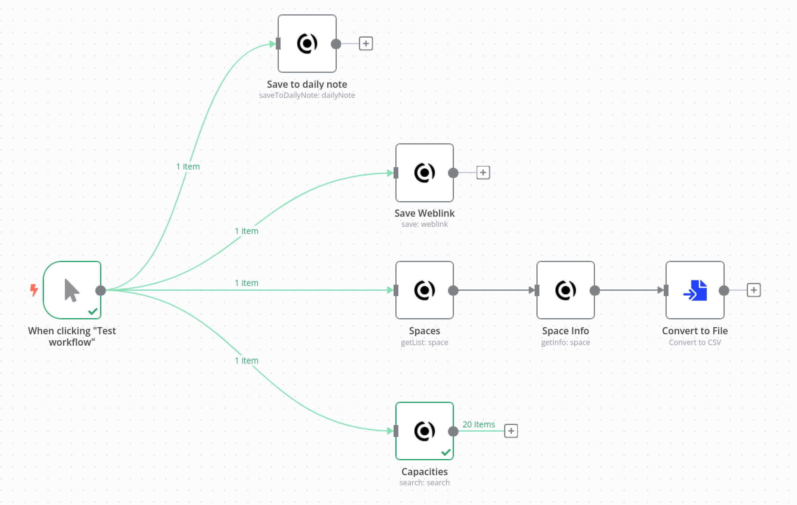
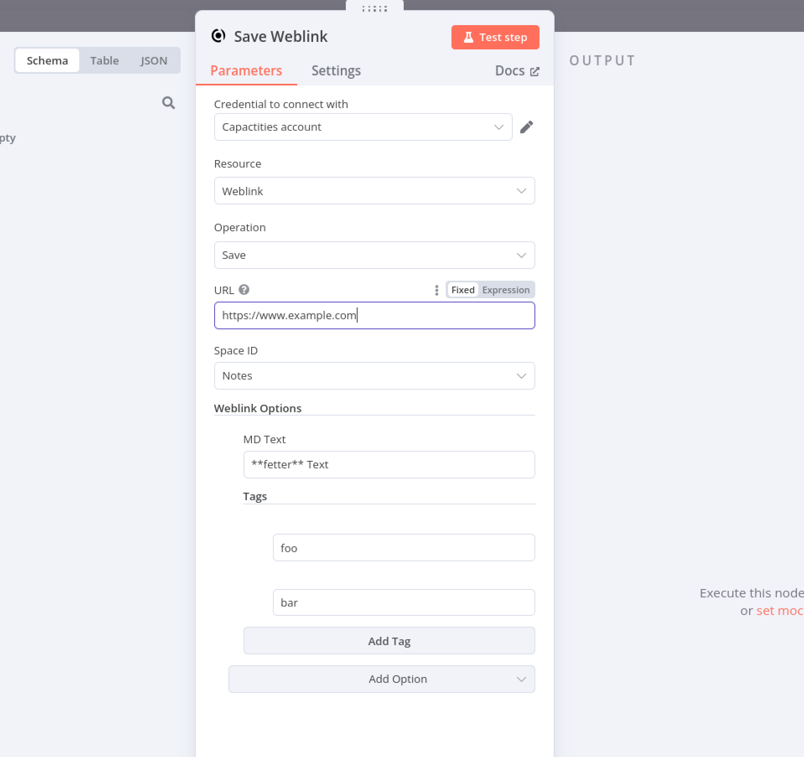

# n8n-nodes-capacities

This repository contains the code for the n8n nodes that interact with the [Capacities API](https://developers.capacities.io).

## API Versions

This node ships two versions side by side:

- **v2 (default for new nodes)** talks to the current [Capacities v1 API](https://developers.capacities.io/api/overview/migration). Tokens are scoped to a single space, so there's no more Space ID selector. Weblink tags use the v1 property model and are selected from existing `RootTag` objects.
- **v1 (legacy, kept for existing workflows)** talks to the deprecated Capacities Beta API. Workflows created before this update keep using it unchanged. Capacities is retiring the Beta API on **2026-09-01** — after that date, `v1`-typed nodes will stop working and existing workflows should be re-saved with a new Capacities node (or have their node version bumped) to pick up `v2`.

If you're building a new workflow, use a fresh Capacities node and a personal API token generated under **Settings → Capacities API** in the desktop app.

## Installation

Install the package into your n8n instance (Community Edition or self-hosted) so the bundled node becomes 
available in the editor sidebar. The n8n team recommends pnpm, but npm should also work as well.

```bash
pnpm add @muench-dev/n8n-nodes-capacities
```

> Prefer npm? Run `npm install @muench-dev/n8n-nodes-capacities` instead.

## Node Features

- Space operations
	- Get the space the API token is scoped to
	- Retrieve structure metadata for the space
- Search operations
	- Query notes, bookmarks, or other content, optionally filtered by structure type
- Weblink operations
	- Save URLs into Capacities, including optional markdown, title, description, and searchable tag properties
- Tag operations
	- Save tags as `RootTag` objects for later use in object tag properties
- Object operations
	- Create an object of any structure/type, with a title plus optional additional properties, collections, and block content
	- Create an object directly from Markdown body content (`POST /object/markdown`)
	- Append Markdown content to an existing object's body (block-append endpoint)
	- Update From Markdown Frontmatter: update an object's properties from a YAML frontmatter block in a Markdown string, without touching its body content (`PATCH /object/markdown`) — see [Updating Properties From Markdown Frontmatter](#updating-properties-from-markdown-frontmatter) below
- Daily note operations
	- Append markdown to a daily note, optionally skipping the automatic timestamp or targeting a specific date

## Screenshots




## Mapping Label & Entity Properties

When creating or updating objects, you can define label and entity properties using the **Properties to Send** section or within **Properties (JSON)**. The node dynamically parses several input formats:

- **Comma-Separated IDs**: A list of IDs separated by a comma (e.g., `in-progress, done` maps to `[{ id: 'in-progress' }, { id: 'done' }]`).
- **Single String ID**: A single ID (e.g., `in-progress` maps to `[{ id: 'in-progress' }]`).
- **Array of IDs**: A JSON/native array of IDs (e.g., `["in-progress", "done"]` maps to `[{ id: 'in-progress' }, { id: 'done' }]`).
- **Single Object (JSON or Native)**: A single object containing an `id` property (e.g., `{"id": "in-progress", "name": "In Progress"}` maps to `[{ id: 'in-progress' }]`).
- **Nested Label/Entity Output (Direct Mapping)**: A fully qualified property structure mapped from another Capacities node output (e.g., `{"type": "label", "label": [{"id": "in-progress"}]}` maps to `[{ id: 'in-progress' }]`).

### Example: Creating a Task

To create a new Task in Capacities (structure ID `RootTask`):

1. **Set Structure**: Choose or specify `RootTask` as the **Structure Name or ID**.
2. **Set Title**: Enter the task's title.
3. **Configure Properties (under Additional Fields → Properties to Send)**:
   - **Date** (e.g., when the task was scheduled):
     - **Property ID**: `date`
     - **Type**: `Date`
     - **Value**: `2026-08-13T10:25:37.585Z` (automatically parses to time resolution)
   - **Priority**:
     - **Property ID**: `priority`
     - **Type**: `Label / Select`
     - **Value**: `medium` (automatically maps to option with ID `medium` and fallback name `medium`) or `{"id": "medium", "name": "Medium"}` to explicitly provide the display name.

Alternatively, you can define all properties using **Properties (JSON)**:

```json
{
  "date": {
    "type": "date",
    "date": {
      "dateResolution": "time",
      "start": "2026-08-13T10:25:37.585Z",
      "end": null
    }
  },
  "priority": {
    "type": "label",
    "label": [
      {
        "id": "medium",
        "name": "Medium"
      }
    ]
  }
}
```

## Updating Properties From Markdown Frontmatter

The **Update From Markdown Frontmatter** object operation (`PATCH /object/markdown`) only ever reads the YAML frontmatter block of the **Markdown Frontmatter** field — it never touches the object's body content. It's a shortcut for setting a few plain-value properties without building the typed JSON properties structure used by **Properties (JSON)** / **Properties to Send**, and it works differently from **Create From Markdown** and **Append From Markdown**, which instead set/append actual body content:

- The **Markdown Frontmatter** field must start with a YAML frontmatter block delimited by `---` lines.
- Each key in the frontmatter is a property ID — either a built-in one like `title`, or the UUID of a custom property (the same IDs used elsewhere in this node's Properties (JSON) / Properties to Send fields).
- Each value is the plain value to set (a string, number, or boolean) — not the typed `{ type, ... }` wrapper the JSON-based property fields require.
- Any content after the closing `---` is ignored, so this operation **cannot** change the object body — use Append From Markdown (to add content) or Create From Markdown (when creating) for that instead.
- Omitted properties are left unchanged.

Example — set the title and a custom `description` property on an existing object:

1. **Object ID**: the ID of the object to update.
2. **Markdown Frontmatter**:
   ```
   ---
   title: New Title
   description: Updated description
   ---
   ```

---

## Development

1. Install dependencies using pnpm (recommended for this repository):

```bash
pnpm install
```

2. Build the distributable bundle (outputs to `dist/`):

```bash
pnpm build
```

3. Run the linter to ensure n8n community guidelines are met:

```bash
pnpm lint
```

4. Execute the Jest test suites (API requests are mocked):

```bash
pnpm test
```

Additional context for contributors—coding conventions, testing strategy, and release process—is documented in `AGENTS.md`.
